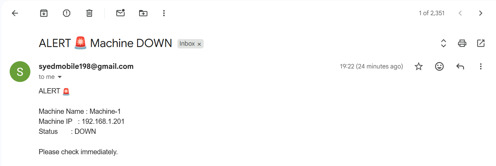

# Linux Machine Availability Monitoring (Email Alert)

## Available Machines

| Machine Name | IP Address    |
| ------------ | ------------- |
| machine-1    | 192.168.1.200 |
| machine-2    | 192.168.1.201 |

> **Note:** Monitoring is performed from one primary machine (machine-1).

---

## Prerequisites

Ensure Python and pip are installed on the monitoring machine.

```bash
python3 --version
sudo apt update && sudo apt install python3 python3-pip -y
```

---

## Setup Directory Structure

Create a dedicated directory for monitoring scripts and logs.

```bash
mkdir ~/monitor
cd ~/monitor
```

Install the required Python library:

```bash
pip3 install ping3
```

---

## Monitoring Script (`monitor.py`)

Create the file `monitor.py` inside `/home/syed/monitor/`.

```python
from ping3 import ping
import smtplib
from email.message import EmailMessage
import time
import logging

# -------- LOGGING --------

logging.basicConfig(
    filename="/home/syed/monitor/monitor.log",
    level=logging.INFO,
    format="%(asctime)s - %(levelname)s - %(message)s"
)

# -------- CONFIG --------

hosts = {
    "Machine-1": "192.168.1.201",
}

SMTP_SERVER = "smtp.gmail.com"
SMTP_PORT = 587
EMAIL_FROM = "syedmobile198@gmail.com"
EMAIL_TO = "syedleather192@gmail.com"
EMAIL_PASSWORD = "GMAIL APP PASSWORD"  # Gmail App Password EX: "abcd efgh ijkl mnop" (16-digit)
CHECK_INTERVAL = 30  # seconds

alerted = set()

# -------- FUNCTIONS --------

def send_email(name, ip):
    msg = EmailMessage()
    msg["Subject"] = "ALERT 🚨 Machine DOWN"
    msg["From"] = EMAIL_FROM
    msg["To"] = EMAIL_TO

    msg.set_content(
        f"ALERT 🚨\n\n"
        f"Machine Name : {name}\n"
        f"Machine IP   : {ip}\n"
        f"Status       : DOWN\n\n"
        f"Please check immediately."
    )

    try:
        with smtplib.SMTP(SMTP_SERVER, SMTP_PORT) as server:
            server.starttls()
            server.login(EMAIL_FROM, EMAIL_PASSWORD)
            server.send_message(msg)

        print(f"📧 Alert email sent for {name} ({ip})")
        logging.info(f"Email sent successfully for {name} ({ip})")

    except Exception as e:
        print(f"❌ Failed to send email for {name}: {e}")
        logging.error(f"Email sending failed for {name} ({ip}): {e}")

def check_hosts():
    for name, ip in hosts.items():
        response = ping(ip, timeout=2)

        if response is None:
            if name not in alerted:
                print(f"{name} is DOWN")
                logging.warning(f"{name} ({ip}) is DOWN")

                send_email(name, ip)
                alerted.add(name)
        else:
            print(f"{name} is UP")
            logging.info(f"{name} ({ip}) is UP")

            if name in alerted:
                alerted.remove(name)

# -------- MAIN LOOP --------

while True:
    check_hosts()
    time.sleep(CHECK_INTERVAL)
```

---

## Log File Setup

Create the log file and set correct permissions:

```bash
touch /home/syed/monitor/monitor.log
chmod 644 /home/syed/monitor/monitor.log
chown syed:syed /home/syed/monitor/monitor.log
```

---

## Manual Testing

Run the script manually to verify functionality:

```bash
python3 /home/syed/monitor/monitor.py
```

Check logs:

```bash
cat /home/syed/monitor/monitor.log
```

---

## Create systemd Service

Create a systemd service to run the script automatically on boot.

```bash
sudo nano /etc/systemd/system/machine-monitor.service
```

Paste the following configuration:

```ini
[Unit]
Description=Machine Availability Monitor
After=network.target

[Service]
ExecStart=/usr/bin/python3 /home/syed/monitor/monitor.py
Restart=always
User=syed
WorkingDirectory=/home/syed/monitor

[Install]
WantedBy=multi-user.target
```

---

## Enable and Start the Service

```bash
sudo systemctl daemon-reload
sudo systemctl enable machine-monitor
sudo systemctl start machine-monitor
systemctl status machine-monitor
```

---

## Viewing Logs

To monitor logs in real time:

```bash
tail -f /home/syed/monitor/monitor.log
```

---

## Outcome Snapshot



---


